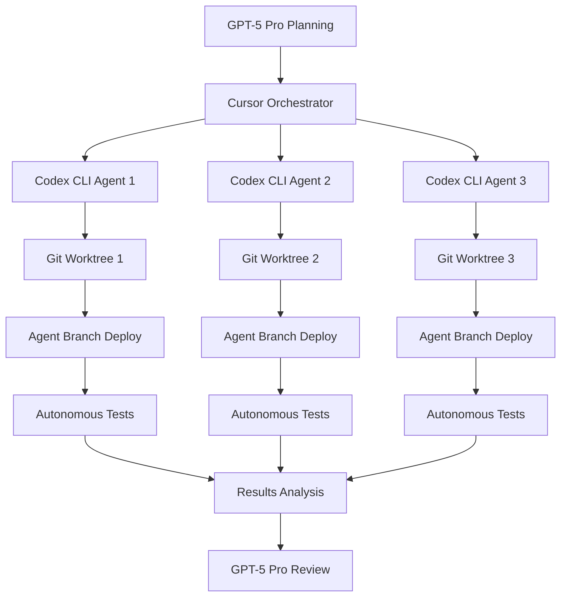

# 🤖 Autonomous Development with Codex CLI

## Overview

This guide explains how to set up and use autonomous AI development with GPT-5-Codex for the Spaceport project. The system enables fully automated development cycles: analyze → implement → test → deploy → validate → iterate.

## 🏗️ Architecture



## 🚀 Quick Start

### Prerequisites

```bash
# Install Codex CLI
npm install -g @openai/codex

# Install Playwright for E2E testing
cd web && npm install @playwright/test
npx playwright install chromium

# Initialize Codex in the repository
codex init
```

### Basic Usage

```bash
# Single autonomous task
python scripts/autonomous/codex-orchestrator.py \
  --task "Fix authentication state persistence" \
  --parallel 1

# Multiple tasks from configuration
python scripts/autonomous/codex-orchestrator.py \
  --config scripts/autonomous/example-tasks.json \
  --parallel 3
```

## 🔧 Configuration

### Codex Configuration (`codex.config.json`)

The configuration defines:
- **Safe commands** that agents can run without approval
- **Deploy commands** for automated deployment
- **Testing strategies** for validation
- **Environment mappings** for branch-based deployments

### Agent Task Definition

```json
{
  "id": "unique-task-id",
  "description": "Human-readable task description",
  "branch_name": "agent/task-branch-name",
  "priority": 1,
  "estimated_time_minutes": 45,
  "success_criteria": [
    "Specific, measurable success criteria",
    "Must pass all automated tests",
    "Frontend loads without console errors"
  ]
}
```

## 🌊 Development Flow

### 1. Task Planning (GPT-5 Pro)
- Analyze requirements and break down into specific tasks
- Define success criteria and acceptance tests
- Estimate complexity and dependencies

### 2. Agent Orchestration (Cursor + Python)
- Create isolated Git worktrees for parallel development
- Spawn Codex CLI agents with specific task instructions
- Monitor agent progress and capture outputs

### 3. Autonomous Implementation (Codex CLI)
Each agent follows this workflow:
```
1. Analyze codebase and understand current implementation
2. Implement necessary changes
3. Run unit tests and fix any failures
4. Commit changes with descriptive messages
5. Push to agent-specific branch
6. Trigger deployment via GitHub Actions
7. Run E2E tests against deployed version
8. Iterate until all tests pass
```

### 4. Validation & Testing
- **Frontend Tests**: Playwright captures console errors, network failures, screenshots
- **Backend Tests**: pytest validates ML pipeline functionality
- **Integration Tests**: End-to-end validation of deployed features

### 5. Review & Merge (GPT-5 Pro)
- Analyze test results and implementation quality
- Review code changes for best practices
- Approve merge to development branch

## 🎯 Branch Strategy

### Agent Branches
- **Pattern**: `agent/{task-id}` (e.g., `agent/auth-fix-123`)
- **Deployment**: Auto-deploys to `https://spaceport-agent-{task-id}.pages.dev`
- **AWS Resources**: Isolated stack with suffix: `SpaceportStack-{task-id}`
- **Lifecycle**: Auto-cleanup after 7 days

### Environment Mapping
- **agent/*** → Staging AWS account + agent-specific subdomain
- **development** → Staging AWS account + preview subdomain  
- **main** → Production AWS account + production domain

## 🧪 Testing Strategy

### Autonomous Test Suite (`tests/e2e/autonomous-test-suite.spec.ts`)

Captures comprehensive data for AI analysis:
- Console errors and warnings
- Network request failures
- Performance metrics (load time, FCP, LCP)
- Screenshots for visual validation
- API endpoint health checks

### Test Output Format
```json
{
  "passed": true,
  "errors": ["CONSOLE ERROR: Authentication failed"],
  "warnings": ["CONSOLE WARNING: Deprecated API usage"],
  "networkFailures": ["NETWORK FAILURE: /api/auth - Connection timeout"],
  "screenshots": ["test-results/landing-page-1234567890.png"],
  "performance": {
    "loadTime": 1250,
    "firstContentfulPaint": 800,
    "largestContentfulPaint": 1100
  }
}
```

## 📊 Monitoring & Observability

### Real-time Monitoring
- Agent status and progress updates
- Resource usage and cost tracking
- Test results and failure analysis
- Deployment success/failure notifications

### Cost Controls
- Maximum execution time limits
- AWS cost thresholds with automatic shutdown
- Resource cleanup for stale deployments

## 🔐 Security & Permissions

### Agent Capabilities
- **Safe Operations**: File editing, testing, git operations
- **Deploy Operations**: Branch pushing, CDK deployment (staging only)
- **Restricted**: No production deployments, no destructive operations

### AWS IAM
- Agents use staging account credentials only
- Least-privilege policies for resource access
- Resource tagging for cost tracking and cleanup

## 🎛️ Advanced Usage

### Parallel Development Slots
```python
# Run 3 agents in parallel with different tasks
orchestrator = CodexOrchestrator(max_parallel_agents=3)
tasks = load_tasks_from_config("complex-refactor.json")
results = await orchestrator.orchestrate_tasks(tasks)
```

### Custom Success Criteria
```json
{
  "success_criteria": [
    "Bundle size reduced by at least 20%",
    "Page load time under 3 seconds", 
    "Lighthouse performance score > 90",
    "All existing tests continue to pass",
    "No new console errors introduced"
  ]
}
```

### Integration with Existing CI/CD
The system leverages your existing GitHub Actions workflows:
- Agent branches trigger `agent-deploy.yml`
- Deployment uses same infrastructure patterns
- Test results integrate with existing monitoring

## 🚨 Troubleshooting

### Common Issues

**Agent gets stuck in infinite loop:**
- Check success criteria are achievable
- Review agent logs for circular dependencies
- Adjust timeout settings in `codex.config.json`

**Deployment fails:**
- Verify AWS credentials and permissions
- Check CloudFormation stack limits
- Review agent branch naming conventions

**Tests fail consistently:**
- Validate test environment setup
- Check Playwright configuration
- Review frontend build process

### Debug Mode
```bash
# Run with verbose logging
python scripts/autonomous/codex-orchestrator.py \
  --task "Debug authentication" \
  --parallel 1 \
  --debug
```

## 🛣️ Roadmap to Full Autonomy

### Phase 1: Foundation ✅
- [x] Agent branch deployment pipeline
- [x] Autonomous test harness
- [x] Basic orchestration system
- [x] Cost and security controls

### Phase 2: Enhancement (Week 2-3)
- [ ] Real-time progress monitoring
- [ ] Advanced error recovery
- [ ] Multi-repository support
- [ ] Performance optimization

### Phase 3: Scale (Week 4-6)
- [ ] ML-powered task breakdown
- [ ] Predictive resource scaling
- [ ] Advanced code review automation
- [ ] Integration with project management tools

## 🎯 Success Metrics

### Development Velocity
- **Target**: 5x faster iteration cycles
- **Current**: ~2 hours manual analyze → implement → test → deploy
- **Goal**: ~20 minutes autonomous cycle

### Quality Assurance
- **Target**: 95% test pass rate on first deployment
- **Automated**: Console error detection, performance regression prevention
- **Human-in-loop**: Final review and merge approval

### Cost Efficiency
- **Target**: <$50/day for autonomous development
- **Controls**: Automatic resource cleanup, cost alerts, usage limits

---

## 🚀 Getting Started Today

1. **Install Prerequisites**
   ```bash
   npm install -g @openai/codex
   cd web && npm install @playwright/test
   ```

2. **Run Your First Autonomous Task**
   ```bash
   python scripts/autonomous/codex-orchestrator.py \
     --task "Add loading spinner to project creation form"
   ```

3. **Monitor Progress**
   - Watch GitHub Actions for deployment
   - Check agent deployment at generated URL
   - Review test results and agent logs

4. **Scale Up**
   - Try the example multi-task configuration
   - Customize success criteria for your needs
   - Integrate with your development workflow

The future of development is autonomous, iterative, and fast. Your codebase is ready! 🚀
