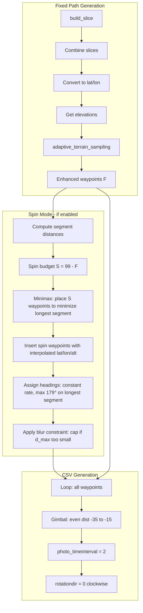

# Multi-Angle Parallax Spin Mode - Implementation Plan

## Overview

Add a "spin mode" that strategically inserts waypoints along the flight path to enable constant-rate clockwise rotation throughout the mission. The drone never stops; it flies at full speed while spinning, maximizing parallax capture per battery time.

---

## Design Summary

| Aspect | Decision |
|--------|----------|
| Spin waypoint altitude | Linear interpolation between neighbors (no elevation API) |
| Spin direction | Always clockwise |
| Starting heading | 0° |
| Gimbal pitch (all waypoints) | Even distribution -35° to -15° (same for spin and fixed waypoints) |
| Photo interval | 2 seconds (time-based) |
| Max heading delta per segment | 179° (Litchi shortest-path limit; ensures clockwise) |

---

## Algorithm Flow



---

## Phase 1: Spin Waypoint Placement (Minimax Algorithm)

**Location**: New method in [`lambda_function.py`](infrastructure/spaceport_cdk/lambda/drone_path/lambda_function.py), called after `adaptive_terrain_sampling` when `spinMode=true`.

### Step 1.1: Compute segment distances

After terrain sampling, we have `enhanced_waypoints_data` with `F` waypoints. Compute:

- `segment_distances[i]` = haversine distance (feet) from waypoint `i` to `i+1`
- `total_distance` = sum of all segment distances

### Step 1.2: Spin budget

```
S = 99 - F
```

If `S <= 0`, skip spin mode (no room for spin waypoints).

### Step 1.3: Minimax placement (binary search)

**Goal**: Place `S` spin waypoints so the longest segment between any two consecutive waypoints is minimized.

**Algorithm**:

1. Binary search on target max segment length `d_max` (in feet).
2. For each candidate `d`:
   - For each segment `i` of length `L_i`:
     - Points needed to split segment so no sub-segment > d: `n_i = ceil(L_i / d) - 1`
   - Total spin points needed: `total_needed = sum(n_i)` over all segments
3. Find smallest `d` such that `total_needed <= S`.
4. Place spin waypoints: for each segment `i`, insert `n_i` points at fractions `1/(n_i+1), 2/(n_i+1), ..., n_i/(n_i+1)` along the segment.

**Output**: New waypoint list with `F + S` waypoints (or fewer if `S` is small). Each spin waypoint has:
- `lat`, `lon`: spherical linear interpolation between neighbors
- `altitude`: linear interpolation of altitude between neighbors (use ground_elevation + AGL logic, or interpolate final altitude)
- `is_spin`: True (for downstream logic)
- `curve`: inherit from previous waypoint or use segment average

### Step 1.4: Blur constraint

**Rule**: Angular velocity must not exceed ~100 deg/s (DJI Mini 2, 1/200s shutter, overcast).

- Flight speed: 8.85 m/s ≈ 29 ft/s
- Time to traverse longest segment: `t_max = d_max / 29` seconds
- Angular velocity if we use 179° on longest segment: `omega = 179 / t_max` deg/s

If `omega > 100`:
- Cap: use `delta_max = 100 * t_max` instead of 179° for the longest segment
- Scale all other heading deltas proportionally so spin rate stays constant

**Minimum segment length** (for reference): `d_min = 179 * 29 / 100 ≈ 52 ft`. If binary search yields `d_max < 52 ft`, we will hit the blur cap.

---

## Phase 2: Heading Assignment (Constant Spin Rate)

**Location**: Same block in `generate_csv` / `generate_battery_csv` where headings are computed.

### Step 2.1: Cumulative distance and heading

- `cumulative_distance[0] = 0`
- `cumulative_distance[i] = cumulative_distance[i-1] + segment_distance[i-1]`

### Step 2.2: Spin rate

- `total_rotation = 360 * num_full_rotations` (e.g. 360° for one full spin over the flight)
- `spin_rate = total_rotation / total_distance` (degrees per foot)

Or, if we cap by longest segment:
- `delta_longest = min(179, 100 * d_longest / 29)`
- `spin_rate = delta_longest / d_longest`

### Step 2.3: Heading per waypoint

```
heading[i] = (cumulative_distance[i] * spin_rate) % 360
```

Round to integer. Ensure clockwise: `rotationdir = 0` for all waypoints.

---

## Phase 3: Gimbal Pitch Distribution

**Location**: CSV row generation loop.

Replace sinusoidal gimbal with deterministic even distribution in [-35, -15]:

- Use low-discrepancy sequence (e.g. Halton base 2) or: `pitch[i] = -35 + (hash(i) % 21)` mapped to get 21 values from -35 to -15.
- Ensure reproducibility: same mission params always yield same gimbal sequence.

Apply to both fixed and spin waypoints.

---

## Phase 4: Spin Waypoint Altitude and Metadata

For each spin waypoint inserted between waypoint `i` and `i+1`:

- **lat, lon**: `generate_intermediate_points`-style spherical interpolation at the appropriate fraction
- **altitude**: Linear interpolation between `altitude[i]` and `altitude[i+1]` by distance fraction. No elevation API call.
- **ground_elevation**: Linear interpolation between neighbors (reuse `linear_interpolate_elevation` logic)
- **phase**: e.g. `"spin"` for downstream altitude logic (spin waypoints follow same AGL rules as their segment)
- **curve**: Use `curve` from waypoint `i` (or average of segment)

---

## Phase 5: Integration Points

### 5.1 Request parameter

Add `spinMode: boolean` (default `false`) to:
- `/api/csv` request body
- `/api/drone-path` (if used for CSV)
- `generate_battery_csv` path

### 5.2 CSV generation flow

In `generate_csv` (and `generate_battery_csv`):

1. After `adaptive_terrain_sampling` and building `enhanced_waypoints_data`:
   - If `spinMode` and `F < 99`:
     - Call `insert_spin_waypoints(enhanced_waypoints_data, center, ...)`
     - Returns new list with spin waypoints inserted
     - Recompute `spiral_path`, `locations`, `ground_elevations` for the merged list
2. In the CSV loop: use `photo_timeinterval = 2` when `spinMode` (instead of 3)
3. Set `rotationdir = 0` for all waypoints when `spinMode`

### 5.3 Terrain safety compatibility

- `adaptive_terrain_sampling` already respects 99 limit (stops at 20 safety waypoints)
- Spin insertion runs *after* terrain sampling, so we use remaining budget `99 - F`
- Terrain waypoints are fixed; spin waypoints are inserted between any consecutive pair (including around safety waypoints)

---

## Phase 6: Frontend

- Add "Multi-angle parallax (spin mode)" toggle in project creation / flight design UI
- Pass `spinMode: true` in API request when enabled
- Optional: show estimated spin rate or "longest segment" in UI for user feedback

---

## Key Files

| File | Changes |
|------|---------|
| [`infrastructure/spaceport_cdk/lambda/drone_path/lambda_function.py`](infrastructure/spaceport_cdk/lambda/drone_path/lambda_function.py) | `insert_spin_waypoints()`, minimax algorithm, heading assignment, gimbal distribution, `spinMode` param handling |
| Project creation / download UI | `spinMode` toggle, pass to API |
| API handlers | Parse `spinMode` from body, pass to designer |

---

## Constants

| Constant | Value | Notes |
|----------|-------|-------|
| MAX_WAYPOINTS | 99 | Litchi limit |
| MAX_HEADING_DELTA | 179 | Litchi shortest-path; use for clockwise |
| MAX_ANGULAR_VELOCITY_DEG_S | 100 | Blur limit (1/200s, overcast) |
| FLIGHT_SPEED_FT_S | ~29 | 8.85 m/s |
| MIN_SEGMENT_FT_BLUR_SAFE | ~52 | 179 * 29 / 100 |
| PHOTO_INTERVAL_SPIN_MODE | 2 | seconds |
| GIMBAL_MIN | -35 | degrees |
| GIMBAL_MAX | -15 | degrees |

---

## Battery vs Full Mission

- `generate_csv`: Full mission (all slices combined) → spin insertion after full terrain sampling
- `generate_battery_csv`: Single slice → spin insertion after that slice's terrain sampling
- Same `insert_spin_waypoints` logic applies to both; each operates on its own waypoint list

---

## Edge Cases

1. **F >= 99**: Skip spin mode; no waypoints to add
2. **S > 0 but binary search yields d_max very large**: All segments already short; place spin points evenly to further reduce variance
3. **Single segment**: Place all S points along that segment
4. **Battery/slice mode**: `generate_battery_csv` uses a subset of waypoints; spin insertion must run per-slice after that subset's terrain sampling

---

## Testing

1. Unit test: minimax algorithm with known segment lengths
2. Unit test: heading assignment yields constant spin rate, max delta 179°
3. Integration: Export CSV with spin mode, verify waypoint count <= 99, headings increase monotonically (mod 360)
4. Field test: Verify no motion blur at recommended settings (1/200s, ISO 400-800)
